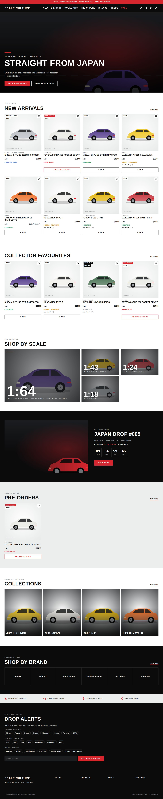
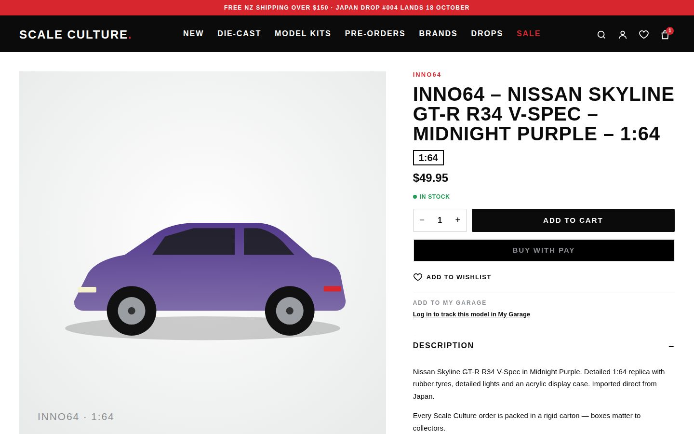
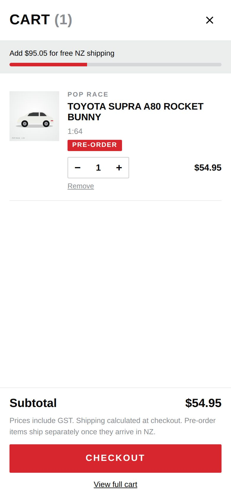

# Scale Culture NZ — Shopify storefront

*Japanese automotive culture. In miniature.*

The Phase 1 and Phase 2 build for the Scale Culture NZ website SOP. It is a premium, mobile-first
Shopify Online Store 2.0 theme, plus the catalogue data model and the tooling the owner
uses to run the store.

> New here? Start with [`HANDOFF.md`](HANDOFF.md): project status, launch order and open decisions.

```
scale-culture-nz/
├── HANDOFF.md                  status, launch order, open decisions — start here
├── theme/                      Shopify OS 2.0 theme (push with Shopify CLI)
│   ├── layout/theme.liquid
│   ├── sections/               hero, product rail, shop-by-scale, drops, brands, filters, cart…
│   ├── snippets/               product card, stock state, pre-order box, facets, SEO/JSON-LD…
│   ├── templates/              JSON templates incl. brand / pre-order / drop / wishlist variants
│   ├── assets/                 base.css, theme.js (no dependencies)
│   ├── config/                 theme settings (stock threshold, shipping, pre-order copy)
│   └── locales/en.default.json
├── scripts/
│   ├── catalogue-schema.mjs    the product data standard: scales, makes, models, metafields
│   ├── setup-store.mjs         creates metafields, the Drop metaobject and ~90 smart collections
│   └── validate-catalogue.mjs  checks a product CSV against the SOP before import
├── preview/                  renders the real theme with sample data → static pages + screenshots
├── shopify-app/              Shopify CLI app: proxy/webhook config + purchase-limits checkout Function
├── collector-service/          Phase 2 backend (Shopify app proxy): My Garage, profiles, synced wishlist
├── data/product-import-template.csv
└── docs/
    ├── setup.md                launch checklist (Shopify, apps, payments, shipping, SEO)
    ├── operations.md           adding stock, inventory workflow, drops, pre-orders, reporting
    ├── screenshots/            generated previews (desktop + mobile)
    ├── bundles-and-limits.md   bundle discounts, drop-day purchase limits, drop-day checklist
    ├── phase-2.md              collector features: My Garage, profiles, alerts, recommendations, reviews
    └── sop-coverage.md         every SOP section → where it's implemented
```

## Quick start

```bash
# 1. Theme
npm i -g @shopify/cli
cd scale-culture-nz/theme
shopify theme dev --store scaleculture.myshopify.com     # live preview
shopify theme push --unpublished                          # upload as a draft theme

# 2. Data model + collections (Admin API token with products/metaobjects/publications scopes)
cd ../scripts
node setup-store.mjs --dry-run
SHOPIFY_STORE=scaleculture.myshopify.com SHOPIFY_ADMIN_TOKEN=shpat_xxx node setup-store.mjs

# 3. Products
node validate-catalogue.mjs ../data/product-import-template.csv
node validate-catalogue.mjs my-products.csv --fix-tags > my-products.ready.csv
# then Shopify Admin → Products → Import
```

The scripts need Node 18 or newer and have no dependencies.

Before launch, work through [`docs/setup.md`](docs/setup.md) in full: payments, shipping,
the Search & Discovery filters, menus, pages and apps.

## Design

| | |
|---|---|
| Palette | Black `#0b0b0c`, charcoal `#1c1d1f`, light grey `#eceded`, white, red accent `#d7262e` (editable in theme settings) |
| Headings | Barlow Condensed (DIN-style condensed), uppercase |
| Body | Inter |
| Imagery | Square product images on a light-grey ground, large full-bleed hero, no autoplay video |
| Mobile | Bottom tab bar (HOME, SHOP, DROPS, SEARCH, CART), sticky Add to Cart, full-screen filter drawer, Apple Pay / Google Pay express buttons |

## How the key pieces work

- **Stock state.** `snippets/stock-state.liquid` is the only place the state is decided. It
  returns In stock, Low stock ("Only N remaining"), Pre-order, Coming soon, Incoming, Sold out
  or Discontinued. The `scale.availability` metafield is the owner's override. When it is set
  to `auto`, the state comes from inventory. A product that is not available can never
  show a buy button.
- **Pre-orders.** Set availability to `preorder` and the inventory policy to *continue*, with
  quantity equal to the allocation. The product page then shows the release and arrival dates,
  the deposit, the allocation left, a disclaimer and a **RESERVE YOURS** button. The line item
  carries a `_preorder` property, so the cart, the account page and fulfilment can split
  pre-orders from in-stock items.
- **Drops.** A `drop` metaobject has a name, number, release date, brands, image, summary
  and collection. It gets its own URL (`/pages/drop/<handle>`), a countdown and a product
  grid, and the drops archive lists every past drop.
- **Vehicle data.** Make, model and generation (`Nissan → Skyline → R34`) are structured
  metafields. They drive the storefront filters, the smart collections and the JSON-LD.
  The validator also writes them into the product tags, so a search for "R34" finds every
  brand's version.

## Phase 2

Phase 2 adds the collector features:

- My Garage, with Owned / Wanted / Pre-ordered statuses, a "Models owned: 84" breakdown by
  manufacturer, and model collections such as "R34 Collection". Purchases are added
  automatically.
- Public collector profiles.
- A wishlist synced to the customer's account, with "N collectors want this" demand counts.
- Interest-based Klaviyo targeting, restock alerts and per-drop reminders.
- "Complete your collection" recommendations.
- Review stars.

To set it up, read [`docs/phase-2.md`](docs/phase-2.md) and
[`collector-service/README.md`](collector-service/README.md). These features stay switched
off in theme settings until the collector service is deployed.

## See it

Open the screenshots in [`docs/screenshots/`](docs/screenshots/). To build them yourself,
run `cd preview && npm install && npm run build`, then open `preview/dist/index.html`.

| Home | Product | Cart drawer (mobile) |
|---|---|---|
|  |  |  |

## Also included

- **Journal** (§33). Blog and article templates with a "Shop this story" product rail,
  driven by the `scale.products` article field, plus a "From the journal" homepage section.
- **Slide-out cart and quick add.** "+ Add" or "Reserve yours" right on product cards. The
  product page adds to the cart without a page reload, and the slide-out cart shows the
  free-shipping progress bar and the pre-order split. Both can be switched off in theme
  settings.
- **Owner dashboard** (§34–35). It runs at `<collector service>/dashboard`, behind a
  password, and shows:
  - today's sales, orders awaiting fulfilment, open pre-orders, low and incoming stock
  - 30-day revenue per day
  - best sellers, and revenue by brand, vehicle manufacturer and scale
  - sell-through per drop
  - sold-out models with wishlist demand

  Set `DASHBOARD_PASSWORD` to enable it. See `collector-service/README.md`.

## Bundles and drop-day limits

- **Bundles.** "Complete the display" on product pages (the model plus display cases,
  stands or dioramas, with a live bundle saving) and a display-case suggestion in the
  slide-out cart. The saving comes from a matching Shopify Buy X Get Y discount.
- **Drop-day purchase limits.** "Max N per customer" on limited releases, optionally
  login-only, until a set date. A checkout Function enforces the limit, so it can't be
  bypassed, and the collector service counts it across separate orders.

See [`docs/bundles-and-limits.md`](docs/bundles-and-limits.md). Try both in the preview on
the INNO64 R34 product page.
